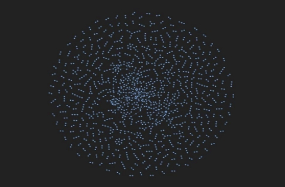
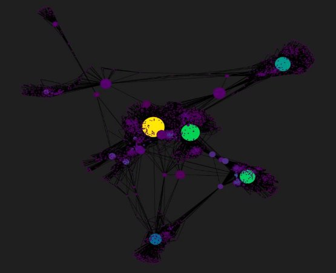
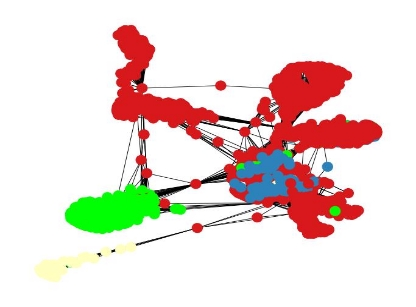
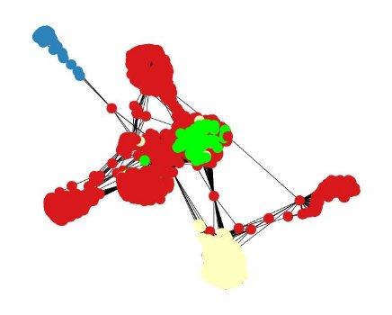
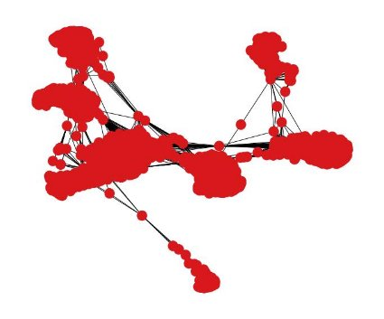

# Clustering Assignment

June 1, 2023

**Problem statement**

The primary objective is to discern and group nodes within a given graph that exhibit shared structural properties, thus uncovering cohorts of individuals with similar characteristics or interests. This endeavor holds tremendous potential across various domains, be it for targeted marketing endeavors, community detection initiatives, or the deeper comprehension of complex social dynamics.

**Methodology**

Local and global features of a graph are both valuable for extracting insights from graph data. The extraction of features from graphs can encompass various characteristics such as node degree, centrality measures, neighborhood information, and more. However, local features are particularly advantageous due to their simplicity in extraction.

Thus, our focus solely lies on understanding the interplay between nodes within their local context. We will use engineered features derived from the neighborhood of the nodes within a range of 2-3 hops. The objective is to employ clustering algorithms on these features to uncover relationships between nodes, identifying patterns, similarities, and potential.

This is essentially achieved in 4 steps:

1. Loading Data
1. Interpretation of Graph data and appropriate representation
1. Feature extraction
1. Realignment of graph data (for clustering techniques)
1. Clustering: K-means, Agglomerative clustering and DB Scan
1. Interpretations
1. Refining the model using derived insights

**Loading Data**

We loaded the facebook\_combined.txt (downloaded from <https://snap.stanford.edu/data/ego-Facebook.html?authuser=1> ) using networkx library. Converting it into an object of a pre-declared class allows us to use its methods and enhances programmability.

We can see the dense nature of the graph from here. It consists of 4039 nodes and 88234 edges.

1

It enhances readability of the graph. We rendered only 1000 random samples using pyvis library. This also adds interactiveness to the graph, allowing us to closely observe each node.![ref1]

2![ref2]

**Interpretation of Graph data and appropriate representation![ref1]**

The graph data is also stored as an adjacency matrix and a laplacian matrix. Degree of each node can be calculated from adjacency matrix. The symmetric positive definite property of laplacian matrix helps us understand much more about each node and its inter-connection with other nodes.

**Feature Extraction**

We have chosen betweenness centrality, eigenvector centrality and degree centrality as central measures of nodes.

Betweenness centrality gives a way of detecting the amount of influence a node has over the flow of information in a graph. The eigenvector centrality gives insight into how important a node is and how important are the neighbors of that node. Degree centrality withholds the number of edges a node has. So, we can now plot graph using these features giving an intuitive sense to viewers on the basis of varying node color with Degree and node size with Betweenness centrality.

3![ref2]

The following image gives the top 7 important nodes that lie central in the above measures![ref1]

The node **1912** is an important node as it is crucial according to all three centrality measures that we had considered.

**Realignment of graph data / Data pre-processing**

We compute eigenvalues and eigenvectors of the laplacian matrix. We use spectral decomposition in-order to map nodes to lower dimensional representation. We decompose the graph into a number of eigenvectors that equals the number of clusters at the point of computation. This is done using the numpy library.

**Clustering: K-means, Agglomerative clustering and DB Scan**

We directly fit our pre-processed data into KMeans, Agglomerative clustering and DBScan classes imported from sklearn.cluster module. We take the number of clusters as 4 for Kmeans and Agglomerative clustering and eps = 0.5 for DB Scan. We color code each node based on the labels it is assigned by the algorithm.

 KMeans @ k = 4

4![ref2]

|

|
Aggl clustering @ n =4

DB Scan @ eps=0.5
|
| - | - |
|5||
|||
**Interpretation!**

We derive interpretations on the clusters using cluster evaluation metrics, such as, Silhouette score, Calinski Harasz index and Davies Bouldin score.

To study the separation distance between the clusters formed by the algorithm silhouette analysis could be used.The higher the Silhouette Coefficients (the closer to +1), the more is the separation between clusters.The Calinski Harabaz index is based on the principle of variance ratio.The higher the index the better is clustering. Davies Bouldin index is based on the principle of with-cluster and between cluster distances.It is different from the other two as the value of this index should be small.

So, we generated the metric values for clusters ranging from 2 to 9 and based on higher Silhouette score Calinski Harasz index and lower Davies Bouldin score, we choose the best number of clusters for k-means and agglomerative clustering respectively. And we got the best model to be K-Means @ k =7, with Silhouette Coefficient: 0.929, Calinski-Harabasz Index: 73000.227 and Davies-Bouldin Index: 0.095

 K - Means @ k = 7

Agglomerative clustering also gives best clusters at n =7, but has lower Calinski Harasz index than K-means at k = 7. DB Scan couldnʼt generate satisfactory clusters, as we need a predetermined metric to evaluate the distance between each nodes, which lacks in a social network graph.

